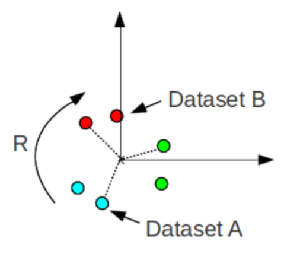

11.11

卡尔曼滤波公式：
$$
X_{k}=A*X_{k-1}+w_1
$$

$$
O_{k}=C*X_{k}+w_2
$$

其中$X_k$为某一时刻的隐藏状态是关键点集在相机坐标系的位置，$A为状态转移矩阵，输入上一时刻关键点集，得到下一时刻关键点集。$C$为相机内外参矩阵。$w_1,w_2$分别为计算误差以及测量误差。$O_k$为平面坐标系的坐标。

A矩阵是超越方程，无法求解。

但是利用当前时刻的关键点集在相机坐标系的坐标以及上一时刻关键点集在相机坐标系的坐标可以求解出旋转矩阵M

$$
H=\Sigma_{i=1}^N(X_{k-1}-ave(X_{k-1}))(X_{k}-ave(X_{k}))
$$
其中$ave()$为关键点集三个维度坐标的平均值。
$$
[U,S,V]=SVD(H)
$$
其中$SVD()$为SVD（Singular Value Decomposition）奇异值分解算法
$$
R = VU^T
$$
R为求解的旋转矩阵
$$
T = -R*ave(X_{k-1})+ave(X_k)
$$
