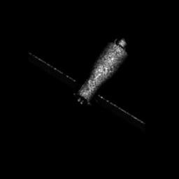
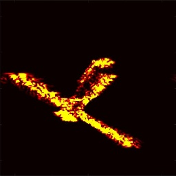
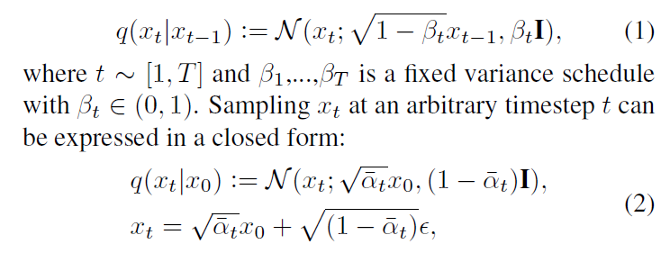
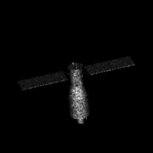
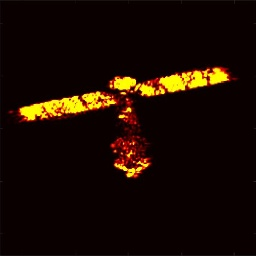
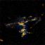

11.18

跨域学习

在本工作中跨域学习是利用光学图像生成同一目标对应的ISRA图像。

这类工作最先考虑到的就是生成模型，例如GAN、VAE、扩散模型等。

本周我首先利用了扩散模型训练了数据。

但是效果并不理想

都一张图为input，第二张图为ground truth，第三张图为output。可以看出网络只能大概描述出形状，而难以画出完整的图像。

而考虑到本工作是图像与图像之间的转化，重点是**转化**而不是生成。不一定需要使用生成模型，直接使用卷积神经网络提取ISRA图像的特征，再提取光学图像的特征，然后计算二者特征的损失即可。（这是一个可行的设想，目前还在实验中，预计下周三前后有结果）