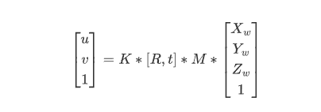
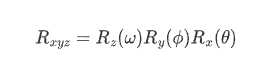
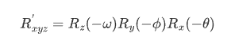
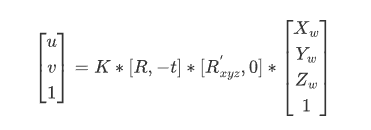
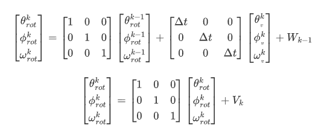
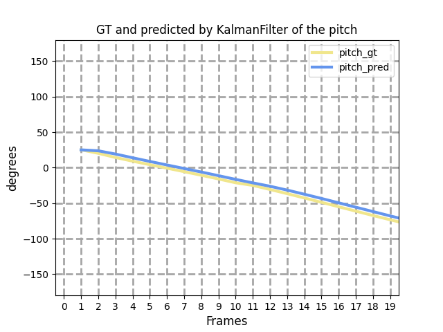
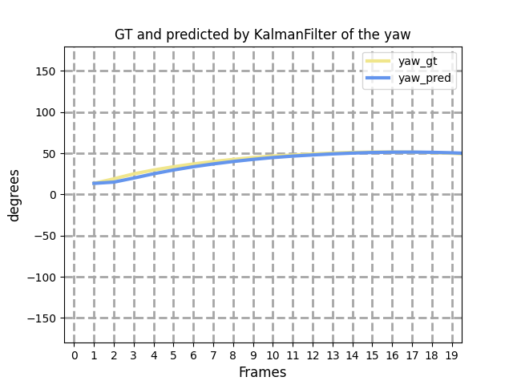
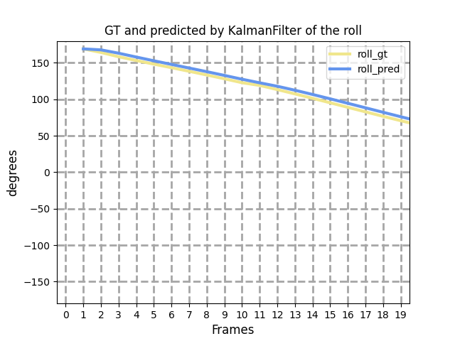

11.4

已知将世界坐标系转化为相机坐标系的公式如下：

其中$k$为相机内参矩阵，$[R,t]$代表相机外参矩阵。$M$代表目标在世界坐标系的模型矩阵，描述了目标在世界中的旋转角与平移量，在实验中卫星没有转动，所以M为单位矩阵。而相机外参矩阵中的$R$表示为：

如果以相机为参考系，描述卫星相对于相机的旋转运动就可以表示为：

以相机为参考的世界坐标系转为相机坐标系公式如下：

利用关键点求解完当前帧的卫星姿态后输入到卡尔曼滤波器中，对状态进行更新。

其中$$\theta_{rot}^{k}，\phi_{rot}^{k}，\omega_{rot}^{k}$$为k时刻的卫星旋转角，$\Delta t$为采样时间间隔， $\theta_{v}^{k}$为采样间隔（k-1时刻~k时刻）的平均角速度。平均误差在4°左右，滤波结果如下图所示：

