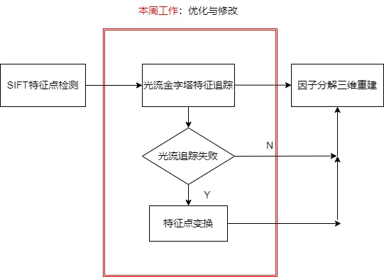
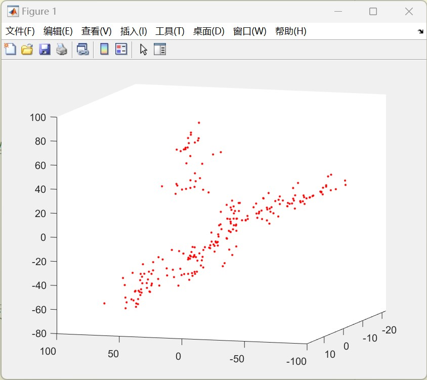
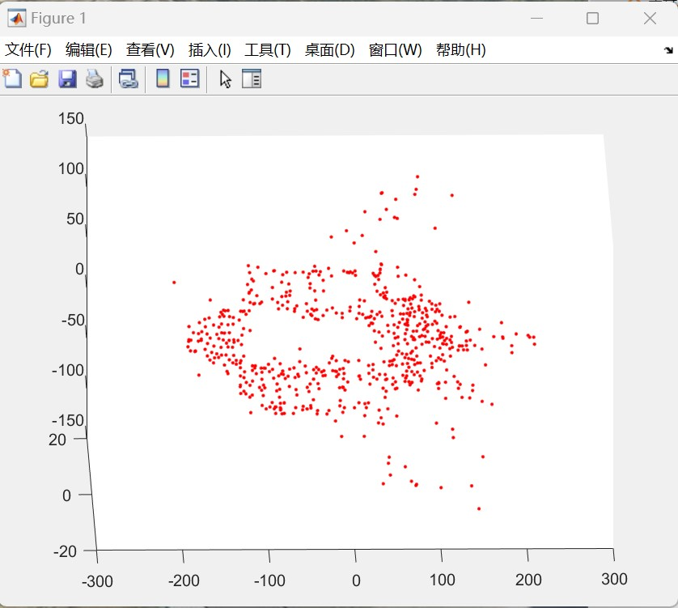
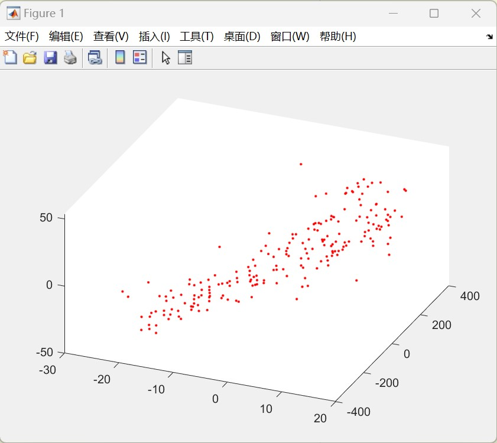

### 姓名：刘营

### 时间：2022.10.21--2022.10.28

## 一.本周工作：

#### 1.检查上周写的代码，修改Bug

#### 2.添加特征点筛选条件，调试和修改光流金字塔函数参数

#### 3.使用修改后的代码进行天宫一号和飞机三维重建

## 二.整体流程及本周工作：

## 三.实验结果：

### 3.1 天宫一号重建结果

### 3.2 SAR飞机重建结果

### 3.3 帆板重建结果

​                                                        
