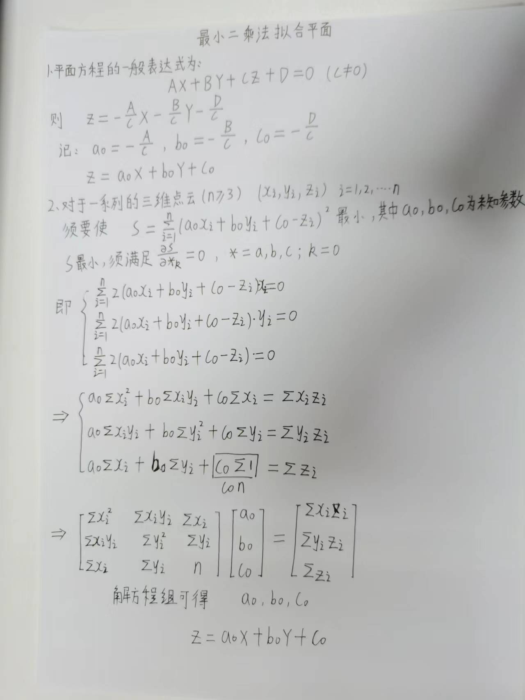
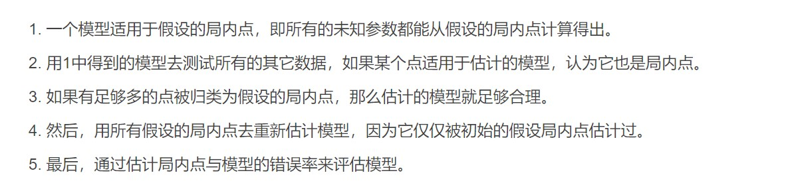

### 姓名： 刘 营

### 时间：2022.11.4--2022.11.11

### 本周工作：

#### （1）使用最小二乘法对三维点云数据进行平面拟合

#### （2）使用Ransac(随机抽样一致算法)对三维点云数据进行平面拟合

### 实验结果：

### 1.使用最小二乘法对三维点云数据进行平面拟合

#### 1.1 最小二乘法拟合原理

#### 1.2 最小二乘法拟合结果（从左到右依次是帆板、飞机、天宫一号结果）

### 2.使用Ransac算法对三维点云数据进行平面拟合

#### 2.1 Ransac算法基本思想

#### 2.2 Ransac算法拟合结果（从左到右依次是帆板、飞机、天宫一号结果）

