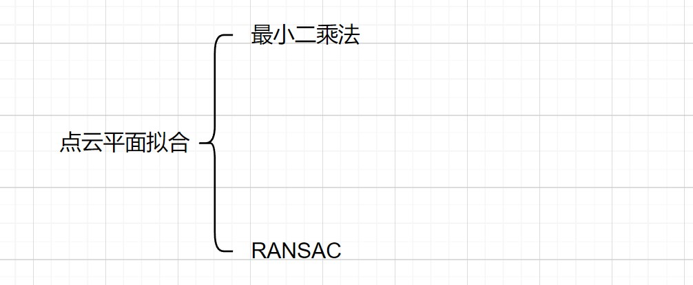

### 姓名： 刘 营

### 时间：2022.11.4--2022.11.11

## 一.本周工作

### 1.1 三维点云平面拟合

#### 

### 1.2 三维点云最小外包框

## 二.三维点云平面拟合

### 2.1 最小二乘法平面拟合

#### 2.1.1 最小二乘法拟合原理

#### 2.1.2 最小二乘法拟合结果（从左到右依次是帆板、飞机、天宫一号结果）

### 2.2 Ransac平面拟合

#### 2.2.1 Ransac算法拟合原理

#### 2.2.2 Ransac算法拟合结果（从左到右依次是帆板、飞机、天宫一号结果）

## 三.三维点云最小外包框

### 3.1轴对齐包围框

#### 3.1.1 轴对齐包围框原理

轴对齐包围框在三维空间中是一个简单的六面体，每一边都平行于一个坐标平面，所以构成的包围框的三条边与坐标轴平行，简称AABB。

### 3.2 方向包围框

#### 3.2.1 基于主成分分析拟合矩形

#### 3.2.2 基于搜索算法近似拟合矩形

迭代遍历所有可能方向，通过评价指标衡量损失最小的即为最优外接框。流程如下：

评价标准：

### 3.3 点云簇凸包

所谓凸包就是针对点集构建一个凸多边形。如下图所示：

常用算法：

**Graham**扫描法：

先将所有的点按照纵坐标优先的方式排序，显然纵坐标最小的点会在凸包上，所以从纵坐标最小的点开始入栈0，按逆时针方向搜索，将角度最小的点压入栈，然后重复操作。

## 四.下周工作

### 4.1 将重建目标投影到拟合平面获得其尺寸

### 4.2 通过点云分割，平面拟合和投影获得真实天宫一号尺寸

### 4.3 整理相关论文，做背景总结

