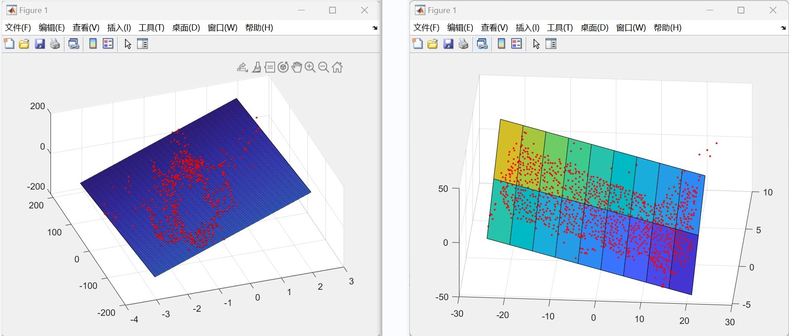

## 本周工作：

------

### 1、三维点云投影到拟合平面

### 2、在拟合平面上求取点云之间距离

------

## 1、三维点云投影到拟合平面

### 1.1 投影原理

### 参考博客：

#### [Projection](https://blog.csdn.net/weixin_44751294/article/details/127616105)

### 1.2 投影结果

### 1.3 求取平面上点云距离

#### 1.3.1 SAR飞机

##### SAR飞机矩形轮廓长宽比：

163.4968 ：136.5824 = 1.20

#### 1.3.2 帆板

##### 帆板长宽比：

41.5066 ：18.08 = 2.30

#### 1.3.3 天宫一号

##### 双翼真实点云：

##### 长宽比：

5499.5263 ：1988.6627 = 2.77

##### 重建双翼点云：

##### 长宽比：

79.2805 ：23.9097 = 3.32

