### 姓名：刘 营

### 时间：2022.10.28--2022.11.4

### 上周工作：

#### 1.使用Fast特征点检测进行三维重建

#### 2.进行重建结果中三维物体的长度提取

## 实验结果：

### 1. Sift与Fast重建结果比较（上：Sift    下：Fast）：

#### 1.1 shutter飞机

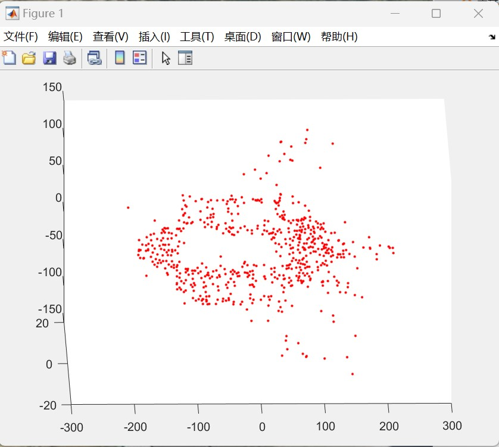

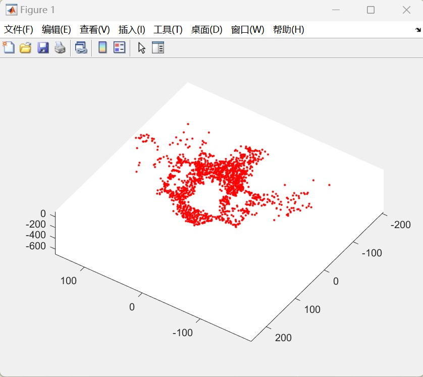

#### 1.2 天宫一号

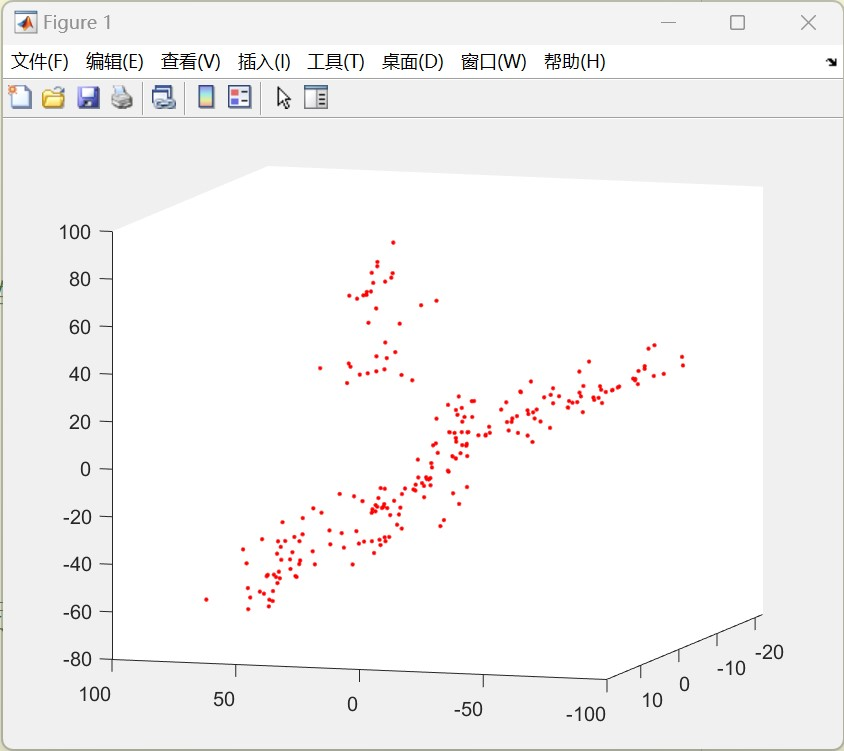

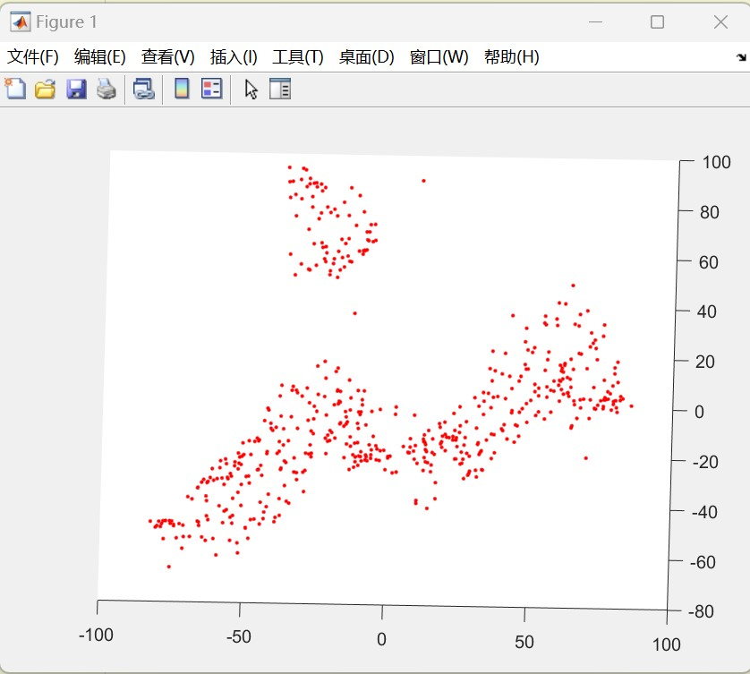

#### 1.3 帆板

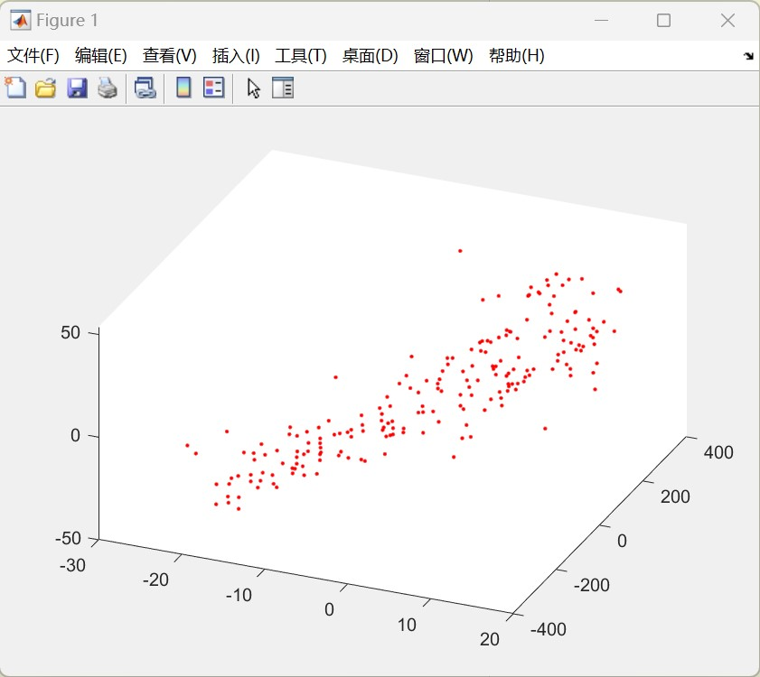

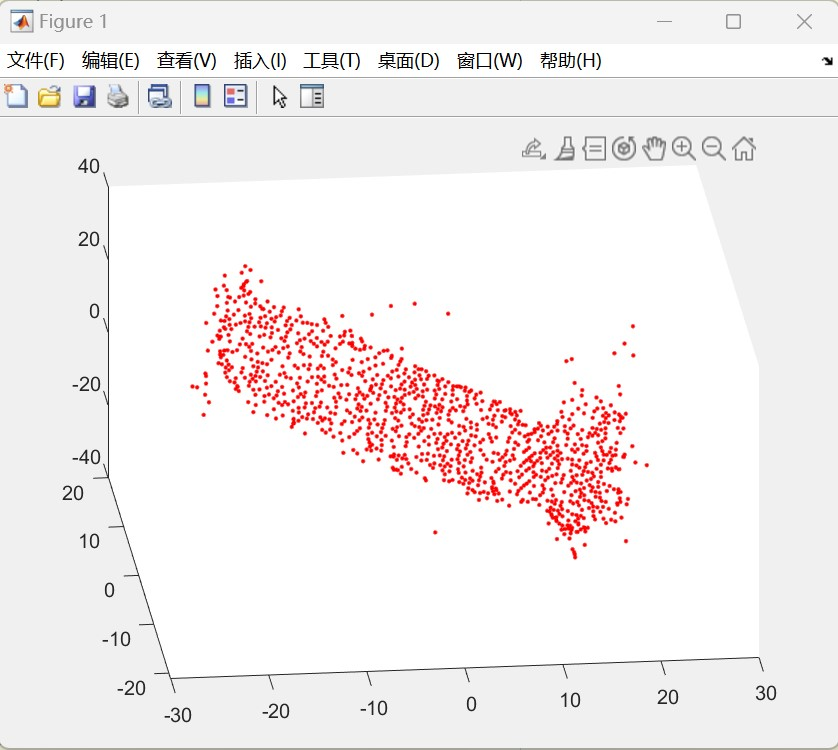

### 2.  获取重建物体长度：

#### 2.1 shutter飞机

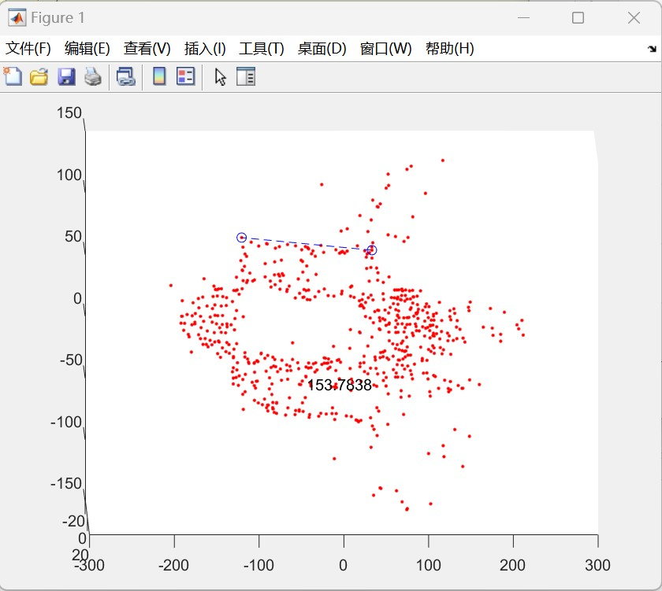

#### 2.2 天宫一号

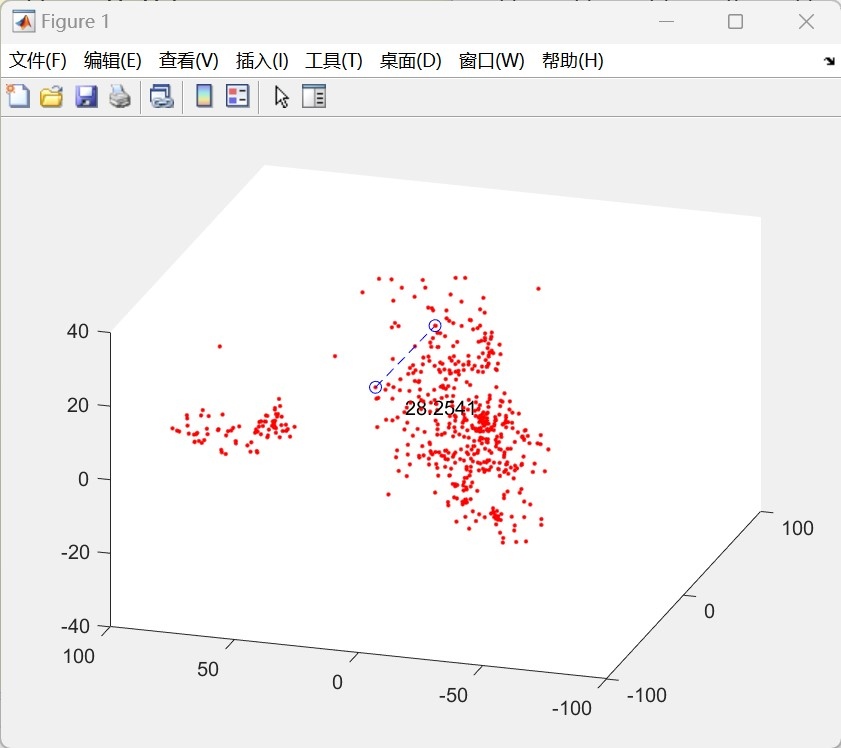

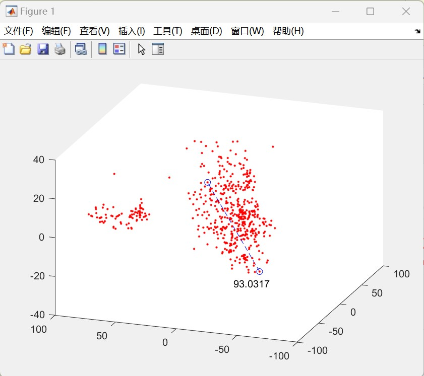

#### 2.3 帆板

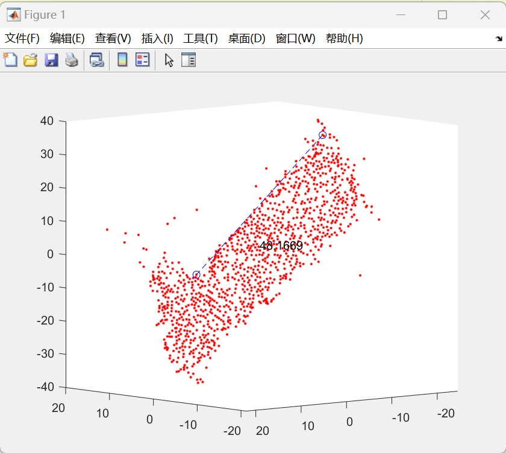

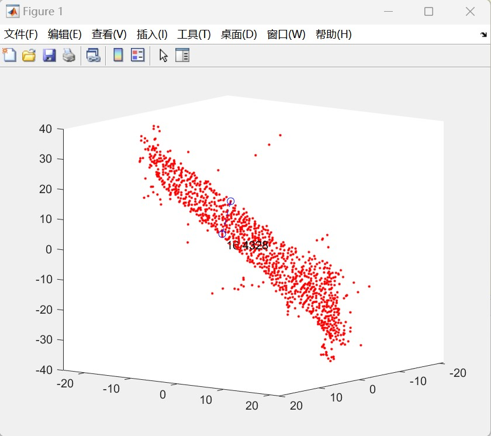

## 总结：

### 1. 对纹理特征明显的物体使用Fast特征点检测重构结果较好，因为检测的特征点数量多，分布均匀

### 2. 纹理特征不明显的物体使用 Sift 特征点检测重构结果较好，因为检测的特征点分布均匀，不会出现特征点凑成一团的情况
