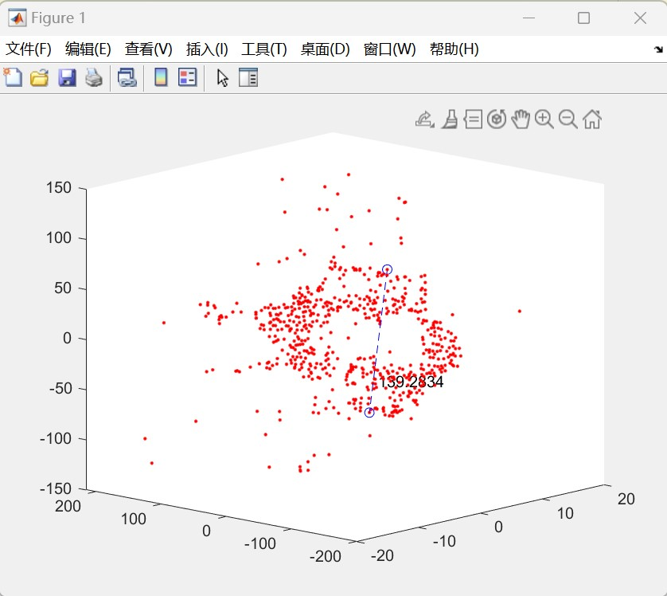
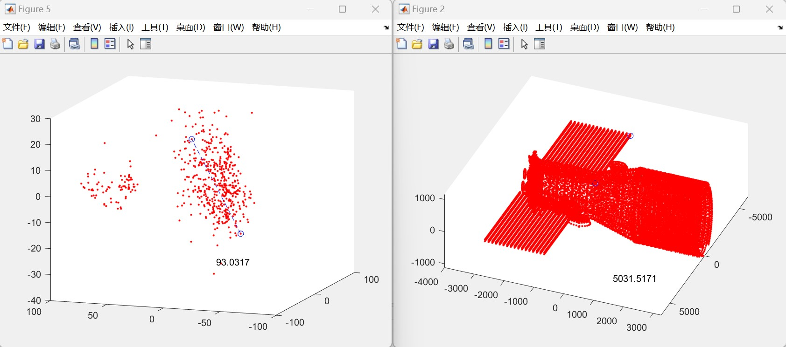
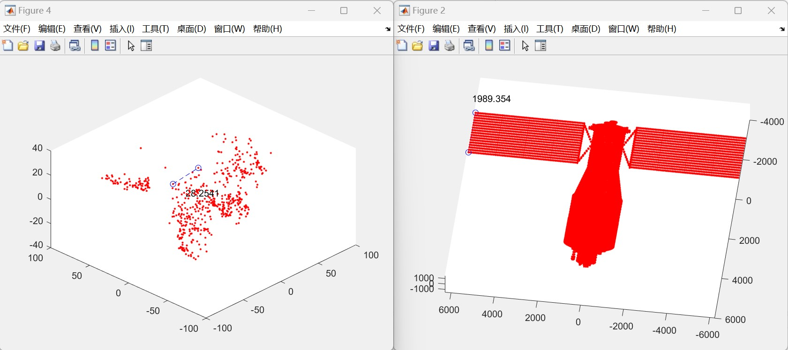

### 姓名：刘 营

### 时间：2022.10.28--2022.11.4

### 本周工作：

#### 1.使用Fast特征点检测进行三维重建

#### 2.进行重建结果中三维物体的长度提取

#### 3.天宫一号真实点云长度与重建结果长度对比

## 实验结果：

### 1. Sift与Fast重建结果比较（上：Sift    下：Fast）：

#### 1.1 shutter飞机

#### 1.2 天宫一号

#### 1.3 帆板

### 2.  获取重建物体长度：

#### 2.1 shutter飞机

#### 2.2 天宫一号

#### 2.3 帆板

### 3.天宫一号真实点云距离与重建结果距离对比

#### 3.1 天宫一号帆板长度对比

​                                        5031.5171 / 93.0317  = 54.084

#### 3.2 天宫一号帆板宽度对比

​                                        1989.354 / 28.2541 = 70.410

#### 3.3 真实长宽比与重构长宽比

##### 真实长宽比：

​                                       5031.5171 / 1989.354 = 2.529

##### 重构结果长宽比：

​                                       93.0317 / 28.2541 = 3.293

#### 总结：

### 1. 对纹理特征明显的物体使用Fast特征点检测重构结果较好，因为检测的特征点数量多，分布均匀

### 2. 纹理特征不明显的物体使用 Sift 特征点检测重构结果较好，因为检测的特征点分布均匀，不会出现特征点凑成一团的情况
