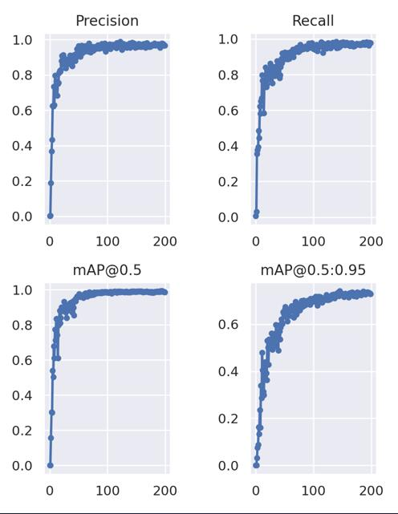
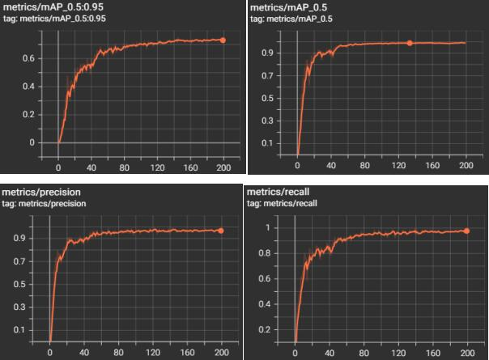
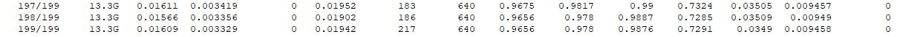

### 第十周

#### 本周工作

* 查阅Ship Detection相关论文  
  <https://www.mdpi.com/2072-4292/14/20/5247>  
  <https://www.mdpi.com/2072-4292/14/20/5148>  
  
* yolov7结果
  
  
  
  比上述论文里的结果要好
 
* 配置GEE本地python环境
  1. GEE官网的编辑器只支持谷歌根据js语言改写的语言
  2. 如果想要上传本地的资源比较麻烦
  3. 代理不稳定，一直断网
  

  

  

  

  

  

  

  

  

  

  

  

  

  
